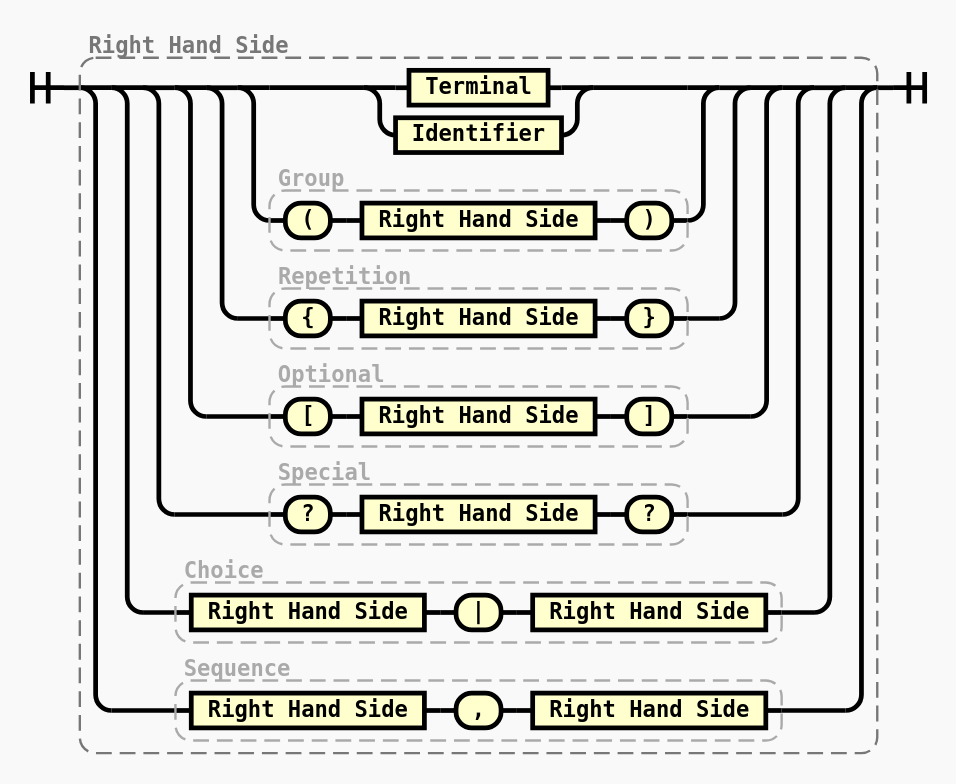

# Getting Started

## Overview

**Choo-Choo** is a lightweight TypeScript library designed for creating railroad diagrams from Extended Backus-Naur Form (EBNF) grammars. This library provides a simple and efficient way to visualize formal grammar specifications.

## Key Features

- Support for both EBNF grammar notation
- Generates railroad diagrams to help visualize complex language syntax
- TypeScript support with full type definitions
- Lightweight and easy to integrate into your projects

## Installation

You can install Choo-Choo using your preferred package manager:

```bash
# Using npm
npm install choo-choo

# Using yarn
yarn add choo-choo

# Using pnpm
pnpm add choo-choo
```

## Basic Usage

This is a library, so you are meant to use it from your own code. Here's all you need to know.

### Import

```typescript
import { Parser, Renderer } from 'choo-choo';
```

### Define your Grammar

```typescript
const grammar = `
Right Hand Side = Terminal
  | Identifier
  | Group
  | Repetition
  | Optional
  | Special
  | Choice
  | Sequence
  ;

Group = "(" , Right Hand Side , ")";
Repetition = "{" , Right Hand Side , "}";
Optional = "[" , Right Hand Side , "]";
Special = "?" , Right Hand Side , "?";
Choice = Right Hand Side , "|" , Right Hand Side;
Sequence = Right Hand Side , "," , Right Hand Side;
`;
```

### Parse

The parser receives an EBNF source and returns its Abstract Syntax Tree (AST).

```typescript
const parser = new Parser();
const parsed = parser.parse(grammar);
```

### Render

Finally, with the renderer receives the parsed tree and lets you choose:

* which definition to represent,
* whether to replace its known identifiers with their definitions.

```typescript
const renderer = new Renderer(parsed);
const rendered = renderer.render('rhs', true);
```

That's it! You have your diagram!

